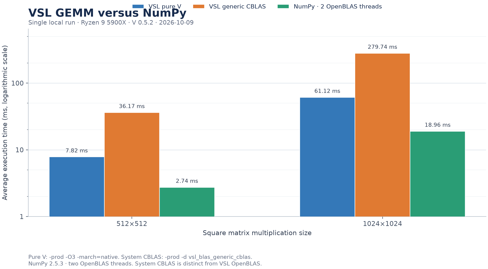

# VSL vs NumPy baselines

Run V commands from `~/.vmodules`, outside the VSL checkout. Compile production
benchmarks with `-prod`, then execute the resulting binary separately so
compiler time is excluded; do not use `v run` for measurements. `-prod` enables
V's production optimizations. Add `-cflags "-march=native"` only for local,
CPU-specific results, and record the compiler and target flags.

VSL is best compared per scientific task: BLAS/LAPACK/FFTW or GSL for
numerical kernels, SciPy for scientific routines, and scikit-learn for
like-for-like estimator tasks. NumPy is useful as an array-operation baseline,
but is not a whole-library proxy for VSL. Match algorithms, inputs, precision,
threading, and backend, and name the backend in every result.

```bash
cd ~/.vmodules
systemd-run --user --scope -p MemoryMax=4G -p MemorySwapMax=0 -- env VJOBS=2 \
	v -prod -o /tmp/vsl-matmul-bench ./vsl/benchmarks/vs_numpy/matmul_bench.v
systemd-run --user --scope -p MemoryMax=1G -p MemorySwapMax=0 -- env VJOBS=2 /tmp/vsl-matmul-bench
systemd-run --user --scope -p MemoryMax=4G -p MemorySwapMax=0 -- env VJOBS=2 \
	v -prod -o /tmp/vsl-gemv-bench ./vsl/benchmarks/vs_numpy/gemv_bench.v
systemd-run --user --scope -p MemoryMax=1G -p MemorySwapMax=0 -- env VJOBS=2 /tmp/vsl-gemv-bench
systemd-run --user --scope -p MemoryMax=4G -p MemorySwapMax=0 -- env VJOBS=2 \
	v -prod -o /tmp/vsl-conv2d-bench ./vsl/benchmarks/vs_numpy/conv2d_bench.v
systemd-run --user --scope -p MemoryMax=1G -p MemorySwapMax=0 -- env VJOBS=2 /tmp/vsl-conv2d-bench
```

For a local build that targets the current CPU's instruction set, add
`-cflags "-march=native"` to the V command. The resulting executable is tied
to that CPU family; omit this flag for portable binaries. For example:

```bash
cd ~/.vmodules
systemd-run --user --scope --quiet -p MemoryMax=768M -p MemorySwapMax=0 -- env VJOBS=2 \
	v -prod -cflags "-march=native" -o /tmp/vsl-matmul-native ./vsl/benchmarks/vs_numpy/matmul_bench.v
systemd-run --user --scope -p MemoryMax=1G -p MemorySwapMax=0 -- env VJOBS=2 /tmp/vsl-matmul-native
```

With OpenBLAS (recommended):

```bash
cd ~/.vmodules
systemd-run --user --scope --quiet --property=MemoryMax=768M --property=MemorySwapMax=0 \
	-- env VJOBS=2 v -d vsl_blas_cblas -prod -o /tmp/vsl-matmul-openblas \
	./vsl/benchmarks/vs_numpy/matmul_bench.v
systemd-run --user --scope -p MemoryMax=1G -p MemorySwapMax=0 -- env VJOBS=2 /tmp/vsl-matmul-openblas
```

On Linux systems that provide `libcblas` but not OpenBLAS, the dense f64 GEMM
benchmark can use the system CBLAS entry point while the other BLAS routines
remain pure V:

```bash
cd ~/.vmodules
systemd-run --user --scope --quiet --property=MemoryMax=768M --property=MemorySwapMax=0 \
	-- env VJOBS=2 v -d vsl_blas_generic_cblas -prod -o /tmp/vsl-matmul-cblas \
	./vsl/benchmarks/vs_numpy/matmul_bench.v
systemd-run --user --scope -p MemoryMax=1G -p MemorySwapMax=0 -- env VJOBS=2 /tmp/vsl-matmul-cblas
```

## NumPy reference (`numpy_baseline.py`)

```bash
cd ~/.vmodules
systemd-run --user --scope --quiet --property=MemoryMax=768M --property=MemorySwapMax=0 \
	-- env VJOBS=2 OPENBLAS_NUM_THREADS=2 uv run --with numpy python \
	./vsl/benchmarks/vs_numpy/numpy_baseline.py matmul
systemd-run --user --scope --quiet --property=MemoryMax=768M --property=MemorySwapMax=0 \
	-- env VJOBS=2 python3 ./vsl/benchmarks/vs_numpy/numpy_baseline.py gemv
systemd-run --user --scope --quiet --property=MemoryMax=768M --property=MemorySwapMax=0 \
	-- env VJOBS=2 python3 ./vsl/benchmarks/vs_numpy/numpy_baseline.py conv2d
```

Compare GFLOPS / ms from the V scripts with the Python output for the same sizes.

The current `matmul_bench.v` measures the public `Matrix * Matrix` operator,
including allocation of its result matrix, matching NumPy's allocating `a @ b`
call. On an AMD Ryzen 9 5900X with V 0.5.2, the pure-V optimized build
(`VJOBS=2`, `-prod -cflags "-O3 -march=native"`) measured 8.75 ms at 512×512
and 61.19 ms at 1024×1024 in the latest run. The NumPy 2.5.3 reference with
two OpenBLAS threads measured 2.10 ms and 17.34 ms. On this host, the pure-V
operator remains about 4.2× and 3.5× slower respectively. The optional
OpenBLAS backend is required for a faster CPU path; backend and host differences
make these local measurements unsuitable as a universal ranking.

The pure-V row-major f64 GEMM default tile was increased from 64 to 128 after
repeated local runs on the same host. With the native production build above,
two 128-tile runs measured 61.80 ms and 61.19 ms at 1024×1024; the 64-tile
reference runs measured 66.86 ms and 69.78 ms. The two-run averages were 61.50
ms and 68.32 ms respectively (about 10% faster). This tuning does not close
the remaining gap to NumPy or replace a tuned BLAS backend; confirm it on
other CPUs before treating it as generally faster.

## f32 SGEMM backend comparison

The dedicated SGEMM pair uses identical deterministic `f32` matrices, three
warmups, seven timed calls, and preallocated output buffers. The V benchmark
prints the selected implementation (`pure-V SIMD`, `CBLAS`, or `generic
CBLAS`) so the result cannot be mistaken for a different backend. Run from
`~/.vmodules`:

```bash
systemd-run --user --scope --quiet -p MemoryMax=768M -p MemorySwapMax=0 -- env VJOBS=2 \
	v -prod -o /tmp/vsl-sgemm-f32 ./vsl/benchmarks/sgemm_f32_bench.v
systemd-run --user --scope -p MemoryMax=1G -p MemorySwapMax=0 -- env VJOBS=2 /tmp/vsl-sgemm-f32
systemd-run --user --scope --quiet -p MemoryMax=768M -p MemorySwapMax=0 -- env VJOBS=2 OPENBLAS_NUM_THREADS=2 \
	uv run --with numpy python ./vsl/benchmarks/vs_numpy/numpy_sgemm_f32_baseline.py
```

On the Ryzen 9 5900X with V 0.5.2 and NumPy 2.5.3, the updated pure-V kernel
measured 3.671 ms at 512×512 with the portable production build and 3.462 ms
with `-cflags "-O3 -march=native"`. The previous kernel measured 4.327 ms and
3.928 ms respectively on the same host. NumPy with two OpenBLAS threads
measured 0.976 ms. The optimized V path is still about 3.8× slower with the
portable build and 3.5× slower with the native build; the output checksums
matched to f32 precision. These are local measurements, not a general ranking.

### Current local host (2026-10-07)

On an AMD Ryzen 9 5900X with V 0.5.2, the native `-O3 -march=native` pure-V
SIMD build measured 3.791 ms before the SGEMM FMA change. After using SIMD
fused multiply-add for the eight vector accumulators, three process runs
measured 2.604, 2.568, and 3.070 ms; the median was 2.604 ms (31% below the
single pre-change run). NumPy 2.5.3 with `OPENBLAS_NUM_THREADS=2` measured
0.971 ms using the same deterministic inputs and a preallocated output. The
V and NumPy checksums were `125.054512` and `125.054504`; the small difference
is expected from f32 rounding. The optimized pure-V kernel was still 2.68×
slower than NumPy on this host, so the change narrows but does not close the
performance gap. Each V benchmark run includes three warmups and seven timed
calls; runs used two V jobs and a 768 MiB memory limit. These measurements
describe this host only.

## Ryzen 9 5900X local sample

The VSL and NumPy scripts use the same deterministic matrices, two warmups, and
five timed calls. One local run with `VJOBS=2` measured:

| Backend | 512×512 | 1024×1024 |
|---|---:|---:|
| VSL pure V, portable target | 12.00 ms | 81.46 ms |
| VSL pure V, `-march=native` | 9.16 ms | 67.73 ms |
| VSL + OpenBLAS 0.3.34 | 1.43 ms | 8.47 ms |
| NumPy 2.5.3, 2 OpenBLAS threads | 2.12 ms | 17.50 ms |

The `-march=native` pure-V build was about 4.3× slower than NumPy at 512×512
and 3.9× slower at 1024×1024 in this run. The OpenBLAS builds differ: VSL
linked to the official Arch OpenBLAS 0.3.34 package, while NumPy used its
wheel-provided BLAS. The OpenBLAS package used for this local VSL run was
signature verified and extracted temporarily rather than installed
system-wide. Rerun these commands on the target host before drawing a general
performance conclusion.

### Updated local sample (2026-10-09)

A fresh run on the same Ryzen 9 5900X host used V 0.5.2, the production build
with `-O3 -march=native`, two warmups, and five timed calls. NumPy 2.5.3 used
two OpenBLAS threads and the same deterministic input values:

| Backend | 512×512 | 1024×1024 |
|---|---:|---:|
| VSL pure V, production + native CPU flags | 7.82 ms (34.34 GFLOPS) | 61.12 ms (35.14 GFLOPS) |
| VSL generic system CBLAS, production | 36.17 ms (7.42 GFLOPS) | 279.74 ms (7.68 GFLOPS) |
| NumPy, 2 OpenBLAS threads | 2.74 ms (97.92 GFLOPS) | 18.96 ms (113.24 GFLOPS) |

In this run, pure V was 2.85× slower at 512×512 and 3.22× slower at
1024×1024. The generic system CBLAS build was 13.20× and 14.75× slower than
NumPy respectively, and slower than the pure-V kernel at both sizes. This
host's generic CBLAS is not an optimized BLAS backend; installing or linking
an arbitrary CBLAS library does not guarantee a faster VSL path. The V
measurements ran with `VJOBS=2` under a 1536 MiB
`MemoryMax`; NumPy ran with `VJOBS=2`, `OPENBLAS_NUM_THREADS=2`, and a 768 MiB
`MemoryMax`. The system did not have OpenBLAS installed, so this run measures
VSL's pure-V and generic system CBLAS paths plus NumPy's wheel-provided
OpenBLAS; it says nothing about VSL's optional OpenBLAS backend. Results are
host-specific. Reproduce the V runs from `~/.vmodules` with:



Vector version: [SVG](gemm-comparison-2026-10-09.svg). Regenerate both formats
from `~/.vmodules` with:

```bash
systemd-run --user --scope --quiet -p MemoryMax=768M -p MemorySwapMax=0 -- env VJOBS=2 \
	uv run --with matplotlib python ./vsl/benchmarks/vs_numpy/plot_gemm_comparison.py
```

The plot records this host-specific sample; do not generalize it to other CPUs.

```bash
systemd-run --user --scope --quiet -p MemoryMax=1536M -p MemorySwapMax=0 -- env VJOBS=2 \
	v -prod -cflags "-march=native" -o /tmp/vsl-matmul-native ./vsl/benchmarks/vs_numpy/matmul_bench.v
systemd-run --user --scope -p MemoryMax=1536M -p MemorySwapMax=0 -- env VJOBS=2 /tmp/vsl-matmul-native
systemd-run --user --scope --quiet -p MemoryMax=1536M -p MemorySwapMax=0 -- env VJOBS=2 \
	v -prod -d vsl_blas_generic_cblas -o /tmp/vsl-matmul-cblas ./vsl/benchmarks/vs_numpy/matmul_bench.v
systemd-run --user --scope -p MemoryMax=1536M -p MemorySwapMax=0 -- env VJOBS=2 /tmp/vsl-matmul-cblas
systemd-run --user --scope --quiet -p MemoryMax=768M -p MemorySwapMax=0 -- env VJOBS=2 OPENBLAS_NUM_THREADS=2 \
	uv run --with numpy python ./vsl/benchmarks/vs_numpy/numpy_baseline.py matmul
```

## Output and reporting

Use the same host, flags, and matrix sizes for both VSL and NumPy. A useful
release note includes:

| Field | Example |
|-------|---------|
| CPU/GPU | `Ryzen 9`, `RTX 4060 Laptop` |
| V flags | `-d vsl_blas_cblas`, `-d cuda`, `-d vulkan` |
| Operation | `matmul`, `gemv`, `conv2d` |
| Size | `512`, `1024`, or Conv2D shape |
| Result | `ms`, `GFLOPS`, ratio vs baseline |

CUDA/Vulkan benchmark variants should be treated as opt-in until dedicated CI
coverage is added. Prefer scoped smoke tests for PR validation.

## Priority sizes

| Op | Shape |
|----|-------|
| GEMM | 128, 256, 512, 1024 |
| GEMV | square `m=n` same sizes |
| Conv2D | `1×1×32×32`, kernel `3×3`, stride 1 |

Tracked in [issue #282](https://github.com/vlang/vsl/issues/282).
